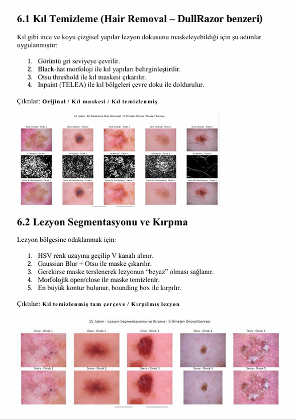
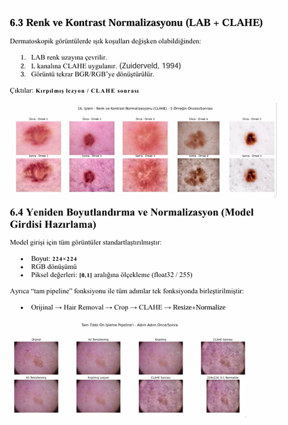
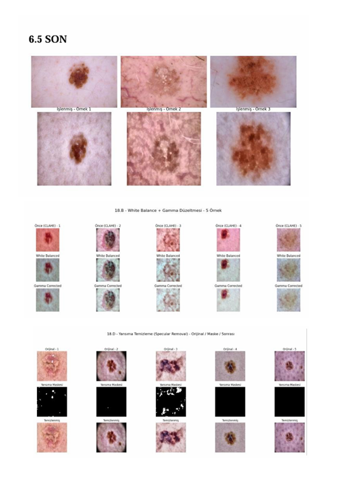
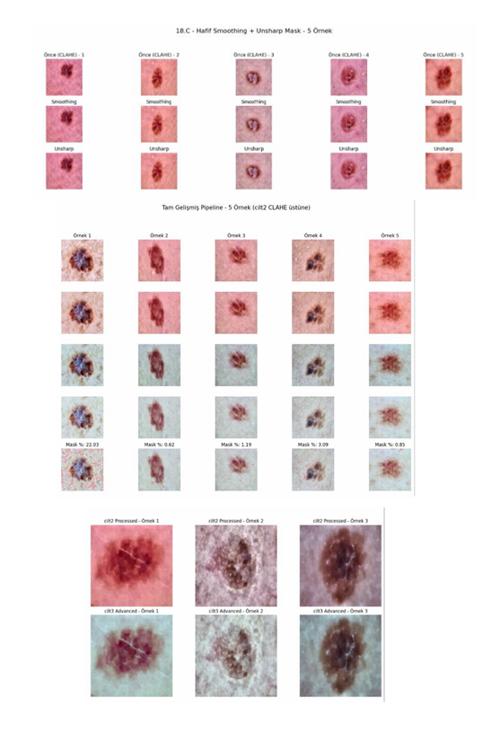

# Cilt-Kanseri-Melanoma-Tespiti-

## 🎯 Problem
Klinik dermatoloji görüntülerinde sınıf dengesizliği, ışık
yansımaları, kıl/parazit gürültüleri ve hasta bazlı veri sızıntısı
(data leakage) nedeniyle modelin genelleme yeteneğinin kısıtlı
olması ve tıbbi teşhis doğruluğunun düşmesi

##  Yaklaşım
Veri sızıntısını engellemek adına "GroupShuffleSplit" tabanlı
izolasyon stratejisi ve iki aşamalı (Feature Extraction & Fine
Tuning) transfer öğrenme protokolü uygulandı. Görüntüler; kıl
temizleme, renk normalizasyonu (CLAHE) ve parlama giderme
aşamalarından oluşan özgün "CİLT2" ve "CİLT3" pipeline'ları ile
optimize edildi.

## 🛠 Kullanılan Teknolojiler
Python, TensorFlow, Keras, OpenCV, NumPy, Pandas,
DenseNet121, Xception, InceptionV3, U-Net.

## 📊 Önemli Bulgular
Model, klinik veriler üzerinde yüksek doğrulukla sınıflandırma
yapabilir hale getirildi. U-Net tabanlı lezyon segmentasyonu ile
lezyon sınırları başarıyla belirlendi. "Balanced Class Weights" ve
"Mixup Regularization" teknikleri ile modelin aşırı öğrenmesi
(overfitting) engellenerek karar sınırları optimize edildi

## 🚀 Nasıl Çalıştırılır?
İlgili `.ipynb` dosyasını Jupyter Notebook veya Google Colab üzerinden açarak kodları inceleyebilirsiniz.

